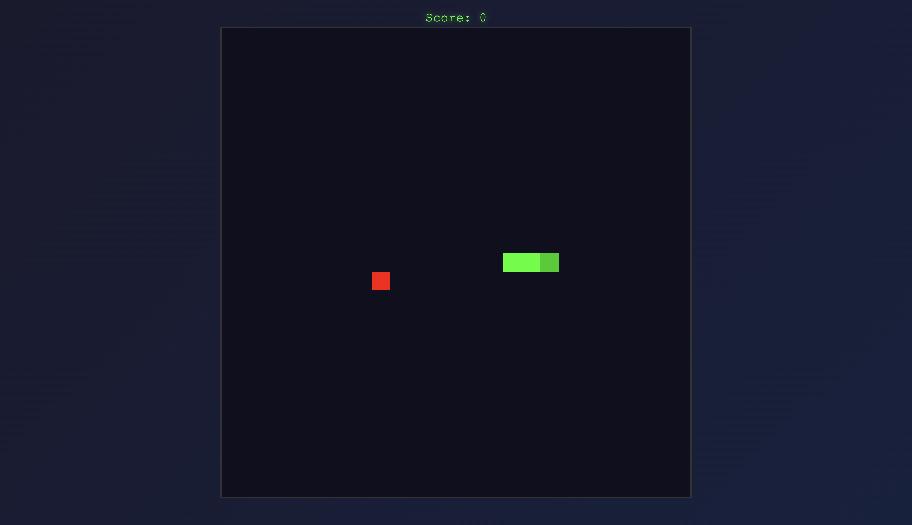

# Snake Game 🐍

A classic Snake game built with vanilla HTML5, CSS3, and JavaScript. Single-file, zero dependencies, and ready to play!



## About

This is a classic Snake game implementation:
- **Clean structure**: Separated HTML, CSS, and JavaScript files
- **Zero dependencies**: Pure vanilla JavaScript, HTML5 Canvas, and CSS3
- **Retro style**: Pixelated graphics with classic green snake
- **Responsive**: Works on desktop and mobile devices

The game uses wrap-around mechanics (snake wraps around screen edges).

## 🎮 Live Demo

Play the game online: **[https://ghaochghaoch.ir](https://ghaochghaoch.ir)**

## Features

- Classic Snake gameplay
- Keyboard controls (Arrow keys, WASD)
- Wrap-around screen edges
- Score tracking
- Self-collision detection

## How to Play

1. Open `index.html` in any modern web browser
2. Use **Arrow Keys** or **WASD** to change direction
3. Eat the red food to grow and increase your score
4. Avoid hitting yourself!

**Controls:**
- **Arrow Keys** or **WASD**: Change direction
- **Spacebar** or **R**: Restart game after game over

## Project Structure

```
.
├── index.html          # Main HTML file
├── css/
│   └── style.css      # All game styles
├── js/
│   └── game.js        # Game logic and engine
└── README.md          # This file
```

The game is organized into separate files:
- **index.html**: HTML structure and page layout
- **css/style.css**: All styling and visual design
- **js/game.js**: Game logic, rendering, and controls

## Running Locally

Simply open `index.html` in your browser. No server needed!

## Customization

You can customize the game by modifying constants in `js/game.js`:

```javascript
const CONFIG = {
    CELL_SIZE: 4,           // Pixels per grid cell
    GRID_SIZE: 25,          // Grid dimensions (25×25)
    TICK_INTERVAL: 150,     // Game speed (milliseconds)
    INITIAL_LENGTH: 3       // Starting snake length
};
```

You can also customize colors in `js/game.js`:

```javascript
const COLORS = {
    background: '#0f0f1e',
    snake: '#00ff00',
    snakeHead: '#00cc00',
    food: '#ff0000',
    // ... more colors
};
```

## License

This project is open source and available for contribution.
