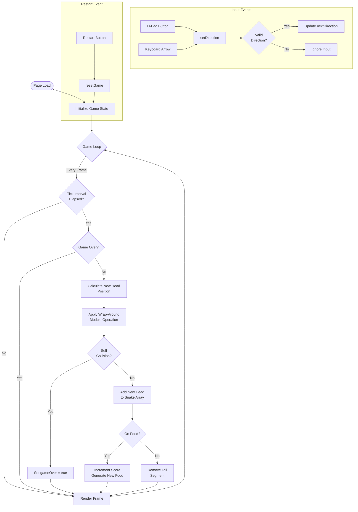

# Snake Game - Technical Specification Document

> **Document Version**: 1.0.0  
> **Last Updated**: 2025-12-18  
> **Author**: Lead Software Engineer  
> **Status**: Ready for Implementation

---

## 1. Executive Summary

This document provides a comprehensive technical specification for building a classic Snake game as a single-page web application. The implementation uses vanilla HTML5 Canvas, CSS3, and ES6+ JavaScript with no external dependencies.

### Project Objectives
- Create a fully functional Snake game with Nokia-style aesthetics
- Single-file deployment (`snake-game.html`)
- Mobile-first responsive design with on-screen D-pad controls
- Cross-browser compatibility

### Technical Stack
| Layer | Technology |
|-------|------------|
| Markup | HTML5 |
| Styling | CSS3 (inline) |
| Logic | Vanilla JavaScript (ES6+) |
| Rendering | Canvas 2D API |

---

## 2. System Architecture

### 2.1 Component Overview

```
┌─────────────────────────────────────────────────────────┐
│                  snake-game.html                        │
├─────────────────────────────────────────────────────────┤
│  ┌─────────────┐  ┌─────────────┐  ┌─────────────────┐  │
│  │    HTML     │  │    CSS      │  │   JavaScript    │  │
│  │  Structure  │  │   Styles    │  │   Game Engine   │  │
│  └─────────────┘  └─────────────┘  └─────────────────┘  │
│         │               │                  │            │
│         └───────────────┴──────────────────┘            │
│                         │                               │
│              ┌──────────┴──────────┐                    │
│              │   Canvas Renderer   │                    │
│              └─────────────────────┘                    │
└─────────────────────────────────────────────────────────┘
```

### 2.2 Game Loop Architecture

```
┌────────────────────────────────────────────────────────────────┐
│                      GAME LOOP (60 FPS)                        │
│  ┌──────────────────────────────────────────────────────────┐  │
│  │  requestAnimationFrame() → deltaTime calculation         │  │
│  │         │                                                │  │
│  │         ▼                                                │  │
│  │  ┌─────────────┐    ┌─────────────┐    ┌─────────────┐   │  │
│  │  │   INPUT     │ →  │   UPDATE    │ →  │   RENDER    │   │  │
│  │  │  Handler    │    │ (tick/150ms)│    │  (Canvas)   │   │  │
│  │  └─────────────┘    └─────────────┘    └─────────────┘   │  │
│  └──────────────────────────────────────────────────────────┘  │
└────────────────────────────────────────────────────────────────┘
```

---

## 3. Implementation Phases

### Phase 1: HTML Structure Setup

**Objective**: Create the foundational DOM structure

**Deliverables**:
- Canvas element (100×100 pixels)
- Score display container
- D-pad control buttons (Up, Down, Left, Right)
- Restart button

**HTML Structure**:
```html
<!DOCTYPE html>
<html lang="en">
<head>
    <meta charset="UTF-8">
    <meta name="viewport" content="width=device-width, initial-scale=1.0">
    <title>Snake Game</title>
</head>
<body>
    <div class="game-container">
        <div class="score-display">Score: <span id="score">0</span></div>
        <canvas id="game" width="100" height="100"></canvas>
        <div class="controls">
            <button data-dir="up" class="ctrl-btn up">▲</button>
            <button data-dir="left" class="ctrl-btn left">◄</button>
            <button data-dir="right" class="ctrl-btn right">►</button>
            <button data-dir="down" class="ctrl-btn down">▼</button>
        </div>
        <button id="restart">Restart</button>
    </div>
</body>
</html>
```

**Acceptance Criteria**:
- [ ] All elements render correctly in browser
- [ ] Semantic HTML structure maintained
- [ ] Viewport meta tag configured for mobile

---

### Phase 2: CSS Styling Implementation

**Objective**: Apply Nokia-style visual design

**Design Specifications**:
| Property | Value |
|----------|-------|
| Background Color | `#1a1a2e` (Dark blue-gray) |
| Snake Body Color | `#00ff00` (Classic green) |
| Snake Head Color | `#00cc00` (Darker green) |
| Food Color | `#ff0000` (Red) |
| Canvas Border | `#333` (Dark gray) |
| Button Color | `#4a4a4a` |

**D-Pad Layout (Grid)**:
```
      [UP]
[LEFT]    [RIGHT]
     [DOWN]
```

**Critical CSS Properties**:
```css
canvas {
    image-rendering: pixelated;
    image-rendering: crisp-edges;
}
```

**Acceptance Criteria**:
- [ ] Centered layout on all screen sizes
- [ ] Pixelated rendering enabled
- [ ] D-pad buttons in cross formation
- [ ] Touch-friendly button sizes (min 44×44px)

---

### Phase 3: Game State Management

**Objective**: Implement core game state data structures

**Constants Definition**:
```javascript
const CONFIG = {
    CELL_SIZE: 4,           // pixels per grid cell
    GRID_SIZE: 25,          // 25×25 grid
    CANVAS_SIZE: 100,       // 100×100 pixels
    TICK_INTERVAL: 150,     // milliseconds between updates
    INITIAL_LENGTH: 3       // starting snake length
};
```

**State Object Schema**:
```javascript
const gameState = {
    snake: [                // Array<{x: number, y: number}>
        { x: 12, y: 12 },   // Head (index 0)
        { x: 11, y: 12 },   // Body segment
        { x: 10, y: 12 }    // Tail
    ],
    direction: 'right',     // Current direction: 'up'|'down'|'left'|'right'
    nextDirection: 'right', // Buffered next direction
    food: { x: 0, y: 0 },   // Food position
    score: 0,               // Current score
    gameOver: false,        // Game state flag
    lastTick: 0             // Timestamp of last tick
};
```

**Direction Vectors**:
```javascript
const DIRECTIONS = {
    up:    { x: 0,  y: -1 },
    down:  { x: 0,  y: 1  },
    left:  { x: -1, y: 0  },
    right: { x: 1,  y: 0  }
};
```

**Acceptance Criteria**:
- [ ] State object properly initialized
- [ ] Snake starts at center of grid
- [ ] Food spawns in random valid position

---

### Phase 4: Core Game Logic

**Objective**: Implement game mechanics

#### 4.1 Tick Function (Game Update)

**Algorithm Flow**:
```
tick():
    1. IF gameOver → RETURN
    2. Apply nextDirection to direction
    3. Calculate new head position
    4. Apply wrap-around (modulo operation)
    5. Check collision with body
        - IF collision → SET gameOver = true; RETURN
    6. Add new head to snake array (unshift)
    7. Check food collision
        - IF on food:
            - score++
            - Generate new food
        - ELSE:
            - Remove tail (pop)
```

**Wrap-Around Implementation**:
```javascript
function wrapCoordinate(value, max) {
    return ((value % max) + max) % max;
}

// Usage:
newHead.x = wrapCoordinate(head.x + dx, CONFIG.GRID_SIZE);
newHead.y = wrapCoordinate(head.y + dy, CONFIG.GRID_SIZE);
```

**Collision Detection**:
```javascript
function checkSelfCollision(head, body) {
    return body.some(segment => 
        segment.x === head.x && segment.y === head.y
    );
}
```

**Food Generation**:
```javascript
function generateFood() {
    let position;
    do {
        position = {
            x: Math.floor(Math.random() * CONFIG.GRID_SIZE),
            y: Math.floor(Math.random() * CONFIG.GRID_SIZE)
        };
    } while (isOnSnake(position));
    return position;
}
```

**Acceptance Criteria**:
- [ ] Snake moves in correct direction
- [ ] Wrap-around works on all edges
- [ ] Self-collision triggers game over
- [ ] Food consumption increases score
- [ ] Snake grows when eating food

---

### Phase 5: Canvas Rendering

**Objective**: Implement visual rendering system

**Render Pipeline**:
```
render():
    1. Clear canvas (fillRect with background color)
    2. Draw food (red square)
    3. Draw snake body (green squares)
    4. Draw snake head (lighter green)
    5. IF gameOver → Draw overlay text
    6. Update score display
```

**Drawing Function**:
```javascript
function drawCell(x, y, color) {
    ctx.fillStyle = color;
    ctx.fillRect(
        x * CONFIG.CELL_SIZE,
        y * CONFIG.CELL_SIZE,
        CONFIG.CELL_SIZE,
        CONFIG.CELL_SIZE
    );
}
```

**Game Over Overlay**:
```javascript
function drawGameOver() {
    ctx.fillStyle = 'rgba(0, 0, 0, 0.7)';
    ctx.fillRect(0, 0, CONFIG.CANVAS_SIZE, CONFIG.CANVAS_SIZE);
    ctx.fillStyle = '#fff';
    ctx.font = '8px monospace';
    ctx.textAlign = 'center';
    ctx.fillText('GAME', CONFIG.CANVAS_SIZE / 2, 45);
    ctx.fillText('OVER', CONFIG.CANVAS_SIZE / 2, 55);
}
```

**Acceptance Criteria**:
- [ ] Smooth rendering at 60 FPS
- [ ] No visual artifacts or flickering
- [ ] Game over message displays correctly

---

### Phase 6: Input Handling System

**Objective**: Implement responsive controls

#### 6.1 Direction Change Logic

**180-Degree Turn Prevention**:
```javascript
const OPPOSITES = {
    up: 'down',
    down: 'up',
    left: 'right',
    right: 'left'
};

function setDirection(newDir) {
    if (OPPOSITES[newDir] !== gameState.direction) {
        gameState.nextDirection = newDir;
    }
}
```

#### 6.2 Touch Controls (D-Pad)

```javascript
document.querySelectorAll('[data-dir]').forEach(btn => {
    btn.addEventListener('click', (e) => {
        e.preventDefault();
        setDirection(e.target.dataset.dir);
    });
    
    // Prevent double-tap zoom on mobile
    btn.addEventListener('touchend', (e) => {
        e.preventDefault();
        setDirection(e.target.dataset.dir);
    });
});
```

#### 6.3 Keyboard Controls (Desktop)

```javascript
const KEY_MAP = {
    ArrowUp: 'up',
    ArrowDown: 'down',
    ArrowLeft: 'left',
    ArrowRight: 'right',
    w: 'up',
    s: 'down',
    a: 'left',
    d: 'right'
};

document.addEventListener('keydown', (e) => {
    const dir = KEY_MAP[e.key];
    if (dir) {
        e.preventDefault();
        setDirection(dir);
    }
});
```

**Acceptance Criteria**:
- [ ] D-pad buttons respond to touch/click
- [ ] Arrow keys work on desktop
- [ ] WASD keys work as alternative
- [ ] 180-degree turns prevented

---

### Phase 7: Game Reset Functionality

**Objective**: Implement restart mechanism

**Reset Function**:
```javascript
function resetGame() {
    const centerX = Math.floor(CONFIG.GRID_SIZE / 2);
    const centerY = Math.floor(CONFIG.GRID_SIZE / 2);
    
    gameState.snake = [
        { x: centerX, y: centerY },
        { x: centerX - 1, y: centerY },
        { x: centerX - 2, y: centerY }
    ];
    gameState.direction = 'right';
    gameState.nextDirection = 'right';
    gameState.food = generateFood();
    gameState.score = 0;
    gameState.gameOver = false;
    gameState.lastTick = performance.now();
    
    updateScoreDisplay();
}
```

**Event Binding**:
```javascript
document.getElementById('restart').addEventListener('click', resetGame);
```

**Acceptance Criteria**:
- [ ] Game resets to initial state
- [ ] Score resets to 0
- [ ] Snake returns to center
- [ ] New food position generated

---

### Phase 8: Game Loop Integration

**Objective**: Tie all systems together

**Main Loop Implementation**:
```javascript
function gameLoop(timestamp) {
    // Calculate delta time
    const elapsed = timestamp - gameState.lastTick;
    
    // Update game state at fixed interval
    if (elapsed >= CONFIG.TICK_INTERVAL && !gameState.gameOver) {
        tick();
        gameState.lastTick = timestamp;
    }
    
    // Always render (smooth animation)
    render();
    
    // Continue loop
    requestAnimationFrame(gameLoop);
}

// Initialize and start
function init() {
    resetGame();
    requestAnimationFrame(gameLoop);
}

// Run on DOM ready
document.addEventListener('DOMContentLoaded', init);
```

**Acceptance Criteria**:
- [ ] Game runs at consistent tick rate
- [ ] Rendering is smooth (60 FPS)
- [ ] Game continues until game over
- [ ] Loop properly restarts after reset

---

## 4. Testing Checklist

### Functional Tests
| Test Case | Expected Result | Status |
|-----------|-----------------|--------|
| Snake moves in initial direction | Moves right continuously | ☐ |
| Direction change (valid) | Snake turns to new direction | ☐ |
| Direction change (180°) | Input ignored | ☐ |
| Wall wrap (right edge) | Snake appears on left | ☐ |
| Wall wrap (left edge) | Snake appears on right | ☐ |
| Wall wrap (top edge) | Snake appears on bottom | ☐ |
| Wall wrap (bottom edge) | Snake appears on top | ☐ |
| Food collision | Score +1, snake grows | ☐ |
| Self collision | Game over triggered | ☐ |
| Restart after game over | Full state reset | ☐ |

### Cross-Platform Tests
| Platform | Browser | Status |
|----------|---------|--------|
| Desktop | Chrome | ☐ |
| Desktop | Firefox | ☐ |
| Desktop | Safari | ☐ |
| iOS | Safari | ☐ |
| Android | Chrome | ☐ |

### Performance Benchmarks
| Metric | Target | Status |
|--------|--------|--------|
| Frame Rate | ≥ 60 FPS | ☐ |
| Memory Usage | < 50 MB | ☐ |
| Input Latency | < 16ms | ☐ |

---

## 5. Configuration Reference

### Adjustable Parameters

```javascript
// Speed adjustment (higher = slower)
CONFIG.TICK_INTERVAL = 150; // milliseconds

// Grid size adjustment
CONFIG.GRID_SIZE = 25;      // cells per axis
CONFIG.CELL_SIZE = 4;       // pixels per cell
CONFIG.CANVAS_SIZE = CONFIG.GRID_SIZE * CONFIG.CELL_SIZE;

// Initial snake length
CONFIG.INITIAL_LENGTH = 3;
```

### Color Palette

```javascript
const COLORS = {
    background: '#1a1a2e',
    snake: '#00ff00',
    snakeHead: '#00cc00',
    food: '#ff0000',
    gameOverOverlay: 'rgba(0, 0, 0, 0.7)',
    gameOverText: '#ffffff'
};
```

---

## 6. Future Enhancement Roadmap

### v1.1 - Score Persistence
- Implement `localStorage` for high score tracking
- Display high score on game over screen

### v1.2 - Progressive Difficulty
- Increase speed as score increases
- Formula: `interval = max(50, 150 - (score * 2))`

### v1.3 - Difficulty Selection
- Add menu screen with difficulty options
- Easy (200ms), Normal (150ms), Hard (100ms)

### v1.4 - Sound Effects
- Add Web Audio API sounds
- Eat food sound, game over sound, movement sound

---

## 7. Appendix

### A. Complete Game Flow Diagram



### B. File Deliverable

**Final Output**: Single `snake-game.html` file containing:
- HTML structure (body)
- CSS styles (`<style>` tag in head)
- JavaScript logic (`<script>` tag before closing body)

**Target File Size**: < 10 KB (unminified)

---

*End of Technical Specification*
